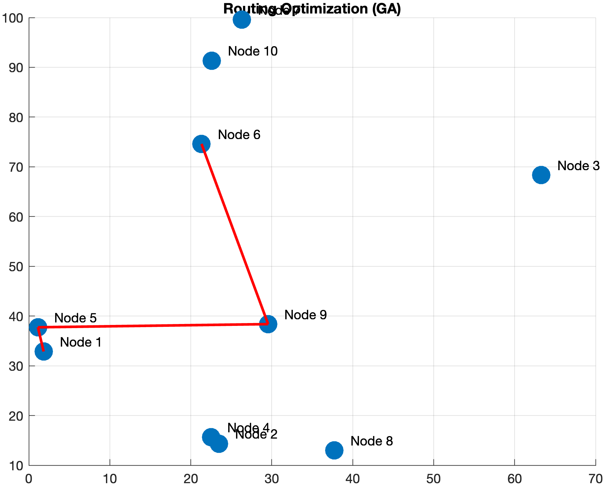
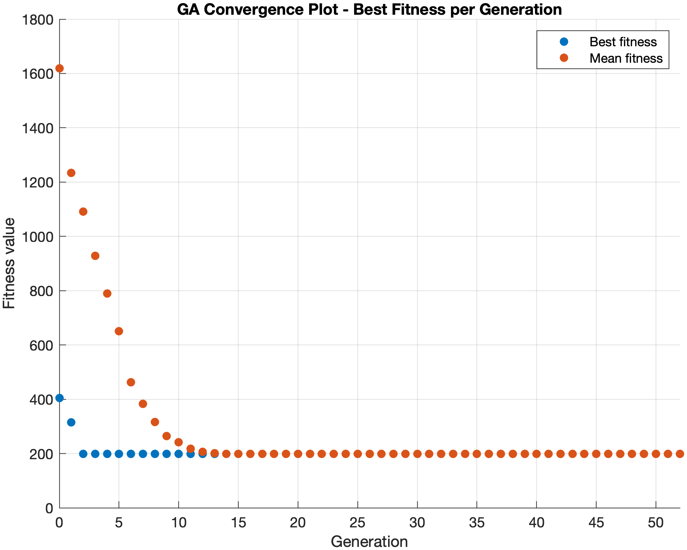

# 🚀 GA Coursework – Genetic Algorithms Projects (MATLAB)

## 🧠 GA-Based Network Routing Optimization Model

**Objective:** Find the optimal routing path from **Node 1 → Node 6** that minimizes communication cost under realistic network constraints.

> ❗ Not just shortest path → ✅ *best feasible path*

### 🔥 Core Idea
- Passing through high-traffic nodes → expensive  
- Passing through low-traffic nodes → cheaper  

---

This repository contains coursework for the **Genetic Algorithms** course, covering both **midterm and final projects** implemented in MATLAB.

It demonstrates:
- Solution representation (Gray Code)
- Custom fitness function design
- Real-world optimization using GA

---

## 📌 Project Overview

### 🔹 Midterm Project
Focuses on fundamental GA concepts:
- Gray Code representation
- Custom fitness function design
- MATLAB-based implementation

---

### 🔹 Final Project  
**Computer Network Routing Optimization using Genetic Algorithms**

Main idea:
> The goal is not where nodes are located, but how data should be intelligently routed between them.


Key features:
- GA-based routing optimization
- Traffic-aware communication cost
- Adjacency matrix (connectivity constraints)
- Capacity matrix (link limitations)
- Multi-factor fitness evaluation
- Convergence analysis and visualization

---

## 📁 Project Structure

```
ga-coursework/
├── docs/
│   ├── GA-final_report.pdf
│   └── GA-midterm_report.pdf
│
├── midterm/
│   ├── fitness_simple.m
│   └── graycode.m
│
├── final/
│   ├── main.m
│   ├── fitness_routing.m
│   └── visualize_results.m
│
├── experiments/
│   ├── fitness_basic.m
│   └── fitness_custom.m
│
├── lecture-codes/
│
├── outputs/
│   ├── convergence_plot_10nodes.png
│   ├── fitness_simple.png
│   └── routing_10nodes.png
│
├── .gitignore
└── README.md
```

---

## 📊 Results Summary

| Feature | Result |
|--------|--------|
| Convergence | ✅ Fast and stable |
| Routing | ✅ Multi-hop optimization |
| Constraints | ✅ Connectivity + capacity respected |
| Behavior | ✅ Network-aware decisions |

🔍 Key Insight:
> Adding traffic, adjacency and capacity transforms simple routing into realistic network optimization.

---

## 📈 Example Outputs

### ✅ Optimized Routing Path


### ✅ GA Convergence Behavior


Generated outputs include:
- GA convergence plots
- Optimized routing paths

---

## 🧠 Key Contribution

- Constraint-based GA routing model
- Integration of traffic, connectivity and capacity
- Demonstration of GA solving real-world network problems

---

## 📎 Reports

- Midterm Report → **[/docs/GA-midterm_report.pdf](https://github.com/semanurbilada/ga-coursework/blob/main/docs/GA-midterm_report.pdf)**
- Final Report → **[/docs/GA-final_report.pdf](https://github.com/semanurbilada/ga-coursework/blob/main/docs/GA-final_report.pdf)**

---

## ✅ Summary

This repository shows the progression from basic GA concepts to a realistic network routing optimization model. The final system demonstrates how genetic algorithms can solve constraint-based decision problems efficiently.

---

## 📌 Citation
If you use ga-coursework in your research, please cite:

```bibtex
@software{ga-coursework2026,
  title   = {GA Coursework: Genetic Algorithm-Based Network Routing Optimization in MATLAB},
  author  = {Semanur Bilada},
  year    = {2026},
  url     = {https://github.com/semanurbilada/ga-coursework}
}
```

---

## Licence

MIT License - see the [LICENSE](https://github.com/semanurbilada/ga-coursework?tab=MIT-1-ov-file) file for details.
